# Among Us in 167

This is one of the [homework projects](http://ivl.calit2.net/wiki/index.php/ProjectsHomeworkCSE167F20) that I made when taking [UCSD CSE167 FA20](http://ivl.calit2.net/wiki/index.php/CSE167F2020) taught by Professor Jürgen Schulze. This toy project resembles the activity in the lobby / waiting room of the popular game [Among Us](https://www.innersloth.com/gameAmongUs.php), where players gather together before the game starts. The project is written in `C++` and `OpenGL`.

The player controls one of the astronauts, the rest of the astronauts and their behaviors are generated by the system randomly. Most of the time, they walk in straight lines and change their direction until run into obstacles or another astronaut. In order to mimic real players, these bot astronauts appear and disappear at random time points and will occasionally stop for a while when walking. Check out this [video demo](https://youtu.be/Rx4uKWIcpb4). (Thanks Baichuan for providing these free online models!)

## Contents
- [Among Us in 167](#among-us-in-167)
  - [Contents](#contents)
  - [Features](#features)
    - [Toon Shading](#toon-shading)
    - [Collision Detection](#collision-detection)
    - [Bot Players](#bot-players)
    - [Particle System](#particle-system)
  - [Miscellaneous](#miscellaneous)
    - [Scene Graph](#scene-graph)
    - [Download](#download)

## Features

### Toon Shading

Toon shading, a.k.a [cel shading](https://en.wikipedia.org/wiki/Cel_shading), provides a cartoon-style look to a 3D object in computer graphics. It emphasizes silhouettes and applies discrete steps for diffuse shading to make the objects appear to be flat.

  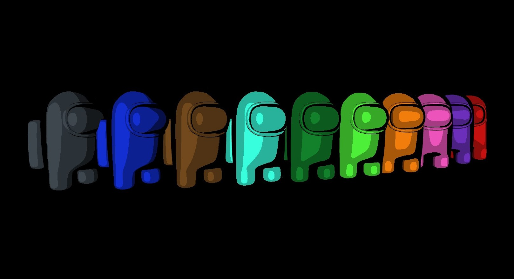

In this project, you can find the shader for toon shading in `shaders/ToonShading.vert` and `shaders/ToonShading.frag`. The trick to emphasize silhouettes is to detect edges by finding normals that are perpendicular to the current viewing direction, drawing black on these pixels. If you want to control the thickness (i.e. make black edges thicker or thinner), use a threshold for the dot product of viewing direction and normals to decide whether or not to draw black.

The discretized shading computes diffuse and specular intensity as usual, and use the intensity to decide which shade intensity level should this pixel fall into. Usually, there are 4 to 5 shade intensity levels.

|                 Phong Reflection                 |                   Toon Shading                   |
| :----------------------------------------------: | :----------------------------------------------: |
| 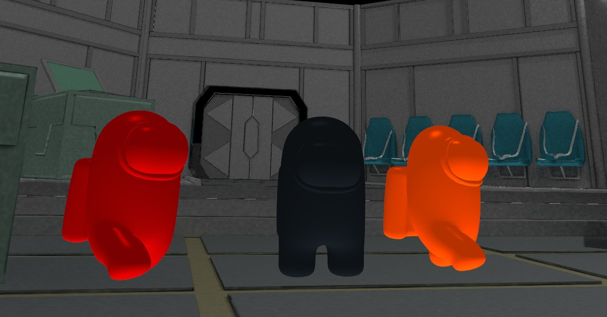 | 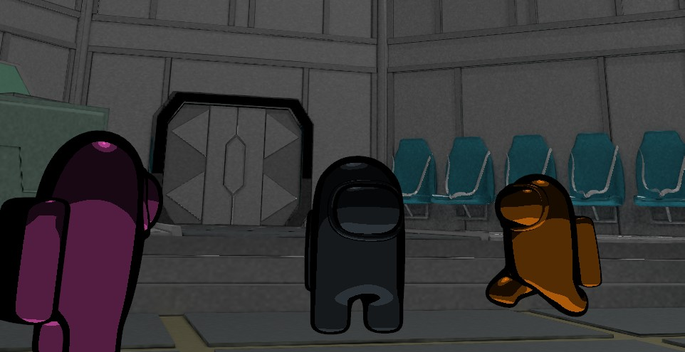 |

### Collision Detection

Each astronaut is associated with a bounding volume (simple shape that completely encloses an object, such as sphere or box). Since characters walk around on a plane, bounding volumes are mapped to 2D (sphere &#8594; circle, plane &#8594; line, etc.), the detection algorithm then loops through all bounding volumes (a fancier algorithm would be [Sweep and prune](https://en.wikipedia.org/wiki/Sweep_and_prune) that reduces the number of pairs of objects need to be checked ) and check whether they intersect with others.

|                     Collision Type                      |            Description             |                                          Detail                                          |
| :-----------------------------------------------------: | :--------------------------------: | :--------------------------------------------------------------------------------------: |
| 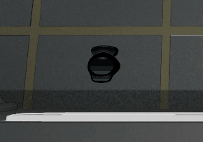  |   Player &#8594; Static obstacle   |     Stop the player's movement until the user chooses a different direction to go in      |
| 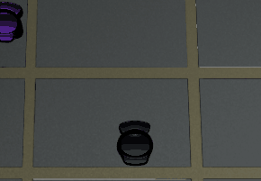 |     Player &#8594; Bot player      |                Player astronaut not affected, the bot player bounced off                 |
| 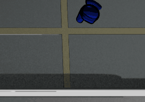 | Bot player &#8594; Static obstacle |                         Angle of incidence = angle of reflection                         |
| 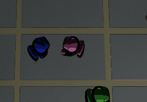 |   Bot player &#8594; Bot player    | Bounce off each other like pool billiard balls, angle of incidence = angle of reflection |

### Bot Players

The user can control one of the astronauts, the rest of the astronauts and their behaviors are generated by the system randomly. Bot players appear at random time points and will eventually disappear from the scene. 

The number of active astronauts in the current scene is limited (10 in this project). Each astronaut has a unique color. To mimic real players, these bot astronauts will also occasionally stop for a while when walking.

  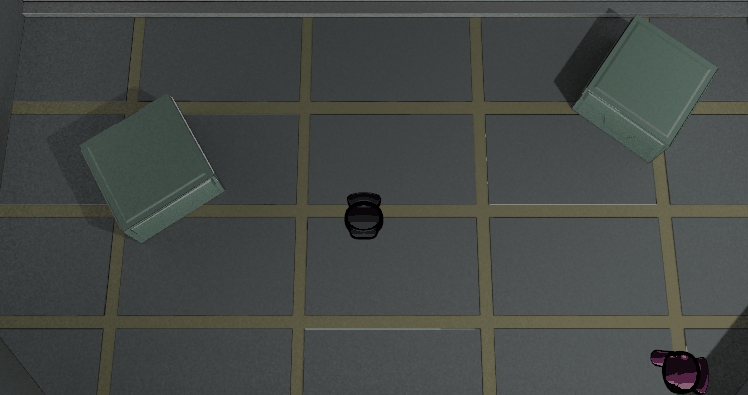

### Particle System

A particle system contains a particle generator that continuously emits new particles that slowly decay over time. A particle system itself may have a life variable. In this project, a new particle effect is created whenever an astronaut shows up or disappear. Each particle effect lasts about 3 seconds. Here's a great [article](https://learnopengl.com/In-Practice/2D-Game/Particles) about particles in OpenGL.

|                   Particle Effect                   |                                       Description                                        |
| :-------------------------------------------------: | :--------------------------------------------------------------------------------------: |
| 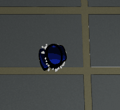  | Shows when a new astronaut appears, particles emitted from the position of the astronaut |
| 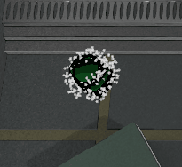 |   Shows when an astronaut disappears from the scene, particles move back to the center    |

## Miscellaneous

### Scene Graph

This project uses [scene graph](https://en.wikipedia.org/wiki/Scene_graph) structure, that is, each object from the scene is represented by a `Geometry` node, it has a parent `Transform` node which contains the object's transformation matrix from the previous level of node. The picture below shows a simple scene graph structure.

  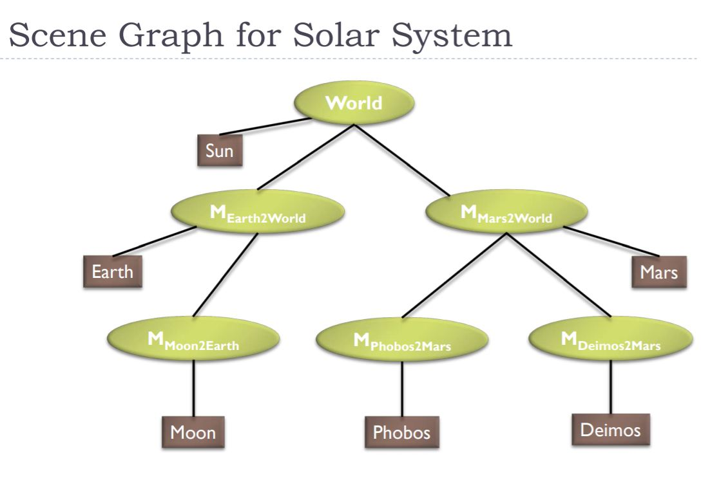

 

 Source: <a href="http://ivl.calit2.net/wiki/images/0/05/11_SceneGraphF20.pdf">http://ivl.calit2.net/wiki/images/0/05/11_SceneGraphF20.pdf</a> 

This is efficient when the objects and their transformations can be grouped into several levels of a hierarchy. Like the one shown above, the Earth and Mars rotate around the Sun while each one has its own moons rotate around itself. This project doesn't have a similar hierarchy though, I used it simply because I reused the code from [project 3](http://ivl.calit2.net/wiki/index.php/Project3F20). :stuck_out_tongue_winking_eye:

### Download

You are welcome to download the executable files (x86) in `Download/` and play with it! :stuck_out_tongue_closed_eyes: Use `WASD` keys to move, `Mouse Wheel` to zoom in / out, and `Mouse Button` to rotate the lobby. 